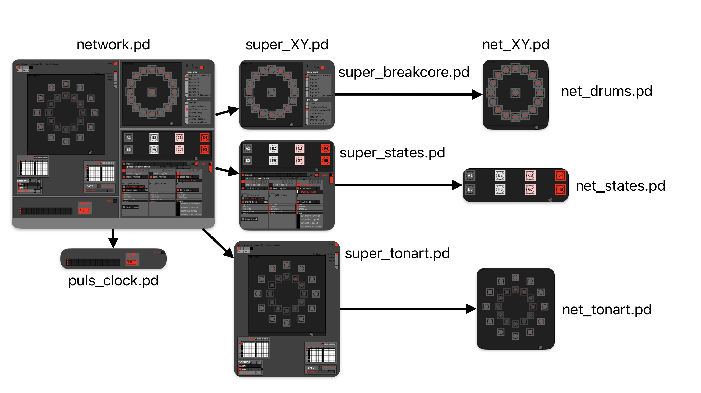

# pd-cybernetic-demo

Demo Project for my experiments with building networks in pd.

## Brief introduction
At the core is the knot.pd abstraction. 
In its essence, it is a bang object which will sample the address of the next bang when it is activated.
When pressed or activated, it outputs a bang to a chosen address (which I will subsequently call "event"), and it will send the corresponding net and knot name of the following knot.
For example, knot1 on net1 might be set up in such a way, that the next knot, knot 2 on the same net1, is triggered next. knot1 might be a kick event, knot2 might be a snare event.

## Requirements
You need a running version of pd and the else library.
If you open the network_performance.pd patch, you WILL get missing object warnings for my synths and drums. 
However, just use network.pd and you can just route the events in your DAW, please check the Mapping section for that.

## Procedure
- Open network.pd.
- Select the required output device for your DAW in the MIDI settings of Pure Data.
- Start the puls-clock.pd within network.pd (red toggle box in the corner).
- Click grey bang button on the bottom (sligthly towards the right) of any net_XY.pd patch (this will set the knot targets and transitions probabilities).
- Click through the first 3 presets (they update on every 16th step of the puls-clock, so make sure that one is on) and figure out your way from there (Some parameters of the super_states only make sense for my performance patch network_performance.pd, however that requires some more work).
- Click any tonart knot (try the a button) > you should see a change in the midiNoteMapping to the right of the network.pd patch
- Click any drum knot (try the KCK button) > you should see a change in the midiNoteMapping to the right of the network.pd patch

## Organization of patches

This is just a demo project. It should only serve as an example of how to structure interaction with the knot object.
network.pd is the main patch.
It contains the puls-clock.pd patch, as well as the 3 super patches, super_tonart.pd, super_breakcore.pd, super_states.pd.
The super patches each contain the corresponding net_XY.pd patches:
super_tonart.pd > net_tonart.pd
super_breakcore > net_drums.pd
super_states > net_states.pd

The net_XY patches each create a network in a subpatch using dynamic patching. 
Please refer to these patches for different visual layouts of networks.

The super_XY patches are the ones actually setting up the events, knots (addresses of other knots of the same network) and transition probabilities of each knot.
I recommend setting up the addresses in such a way, that all knots have the addresses of all other knots in the same network.
This will make it easier to change and inspect probability patterns (A "linear" path through the network would be all zeroes exampt a diagonal of ones shifted by an amount).

The knots all talk to each other using the send/receive addresses feed_in_31415926, respectively feed_out_31415926. Next steps might be rewriting the patches so that they inherit the $0 from the parent patch, but for now this might suffice. 
You can send it the following messages, assuming a net of 4 knots:
- net1 knot1 set knots 1 2 3 4 > this tells knot1 to store the addresses to knots knot1, knot2, knot3, and knot4
- net1 knot1 set probab 1 1 1 1 > this sets the probability of sampling the stored knots to 25% each
- net1 knot1 set probab 0 2 1 1 > this sets the probability of moving to knot1 to 0, to knot 2 to 50%, to knot3 to 25% and knot 4 to 25% as well.
- net1 knot1 set event kick > this sets the adress that knot1 will send a bang to when activated.

In this demo I use a pulse made with a metro object to send a bang at regular intervals. You can however set a delay time to the output of the following address of a knot.
When you "short" the [s feed_in_31415926] and [r feed_out_31415926 objects], you can have a self-playing network. However, with too little of a delay, this can result in a stack overflow.
The corresponding message for setting the delay time to 10 is:
- net1 knot1 set delay 10
or you can simply send 10 to the [s delay_31415926].

## Routing
The network patch produces midi notes.
Drums are on channel 1, Bass on channel 2, Synths are on channel 3-8.
To have sound, select the correct audio device from the MIDI settings of PD.

## Building your own net
A minimum working example / tutorial can be found in the tutorial.pd patch!
This should make setting up a net a little more clear!

The arguemnts for the knots are:
$1: knot number. All knots are part of a single net
$2: net number
$3: knot size
$4: background color
$5: front color
$6: label color
$7: alternative label